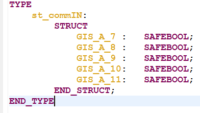
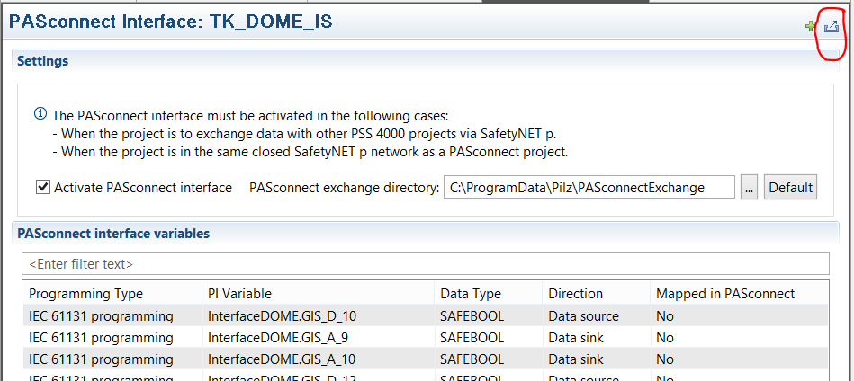
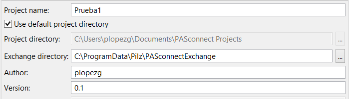
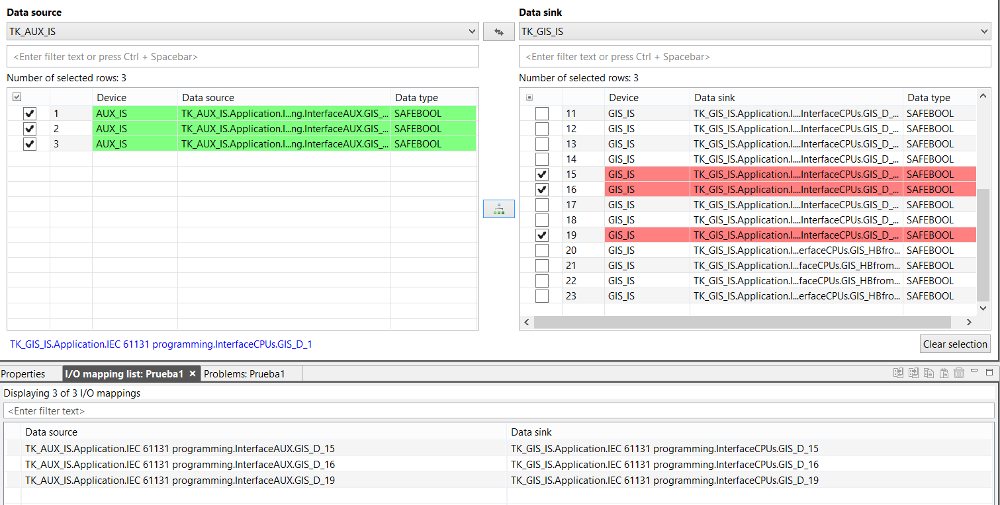
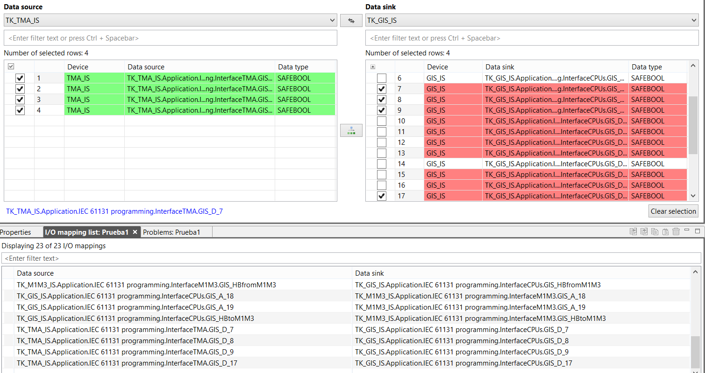
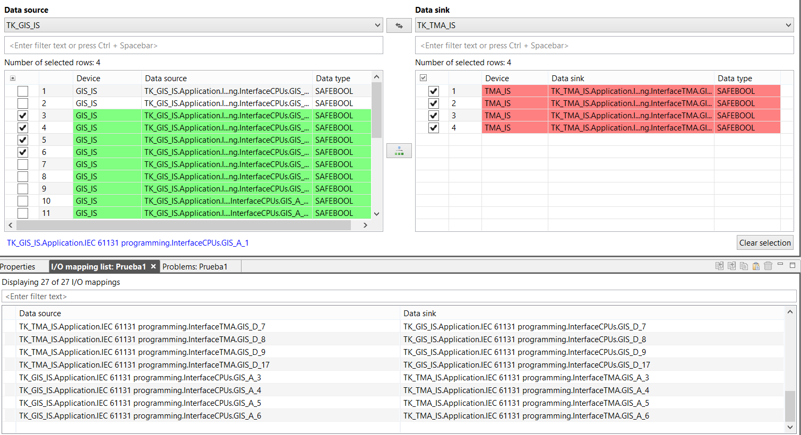

# PAS Connect Integration

|                             |                          |
|-----------------------------|--------------------------|
| **Requested by:**           | **LSST**                 |
| **Doc. Code / Version nº:** | 7186_GIS_0006 / 2.0      |
| **Editor:**                 | F. Javier López          |
| **Approved by:**            | Ismael Ruiz de Argandoña |
| **Date:**                   | 2022/08/30               |

## INDEX

[1. Introduction [4](#introduction)](#introduction)

[2. Reference documents [5](#reference-documents)](#reference-documents)

[3. Create cross-project -Procedure- [5](#create-cross-project--procedure-)](#create-cross-project--procedure-)

[3.1 Each PSS 4000 project [5](#each-pss-4000-project)](#each-pss-4000-project)

[3.2 GIS integrator [11](#gis-integrator)](#gis-integrator)

## DOCUMENT HISTORY

<table>
<colgroup>
<col style="width: 11%" />
<col style="width: 16%" />
<col style="width: 20%" />
<col style="width: 51%" />
</colgroup>
<tbody>
<tr class="odd">
<td><strong>Version</strong></td>
<td><strong>Date</strong></td>
<td><strong>Author</strong></td>
<td><strong>Comments</strong></td>
</tr>
<tr class="even">
<td><strong>1.0</strong></td>
<td>25/03/19</td>
<td><blockquote>

F. Javier López

</blockquote></td>
<td><blockquote>

<em>Initial version</em>

</blockquote></td>
</tr>
<tr class="odd">
<td><strong>2.0</strong></td>
<td>2022/08/30</td>
<td><blockquote>

F. Javier López

</blockquote></td>
<td><blockquote>

<em>After review by Empresarios Agrupados</em>

</blockquote></td>
</tr>
<tr class="even">
<td></td>
<td></td>
<td></td>
<td></td>
</tr>
<tr class="odd">
<td></td>
<td></td>
<td></td>
<td></td>
</tr>
<tr class="even">
<td></td>
<td></td>
<td></td>
<td></td>
</tr>
</tbody>
</table>

<table>
<colgroup>
<col style="width: 15%" />
<col style="width: 84%" />
</colgroup>
<thead>
<tr class="header">
<th><strong>Acronyms</strong></th>
<th><strong>Definition</strong></th>
</tr>
<tr class="odd">
<th>
AFE / AcFiEa

AUX

ETPB

CPU

FS
</th>
<th>
Access Fire Earthquake

Auxiliary telescope

Emergency trip pushbutton

Control Programmable Unit

Fail Save resource
</th>
</tr>
<tr class="header">
<th>GIS</th>
<th>Global Interlock System</th>
</tr>
<tr class="odd">
<th>
HMI

I-PI
</th>
<th>
Human Machine Interface

Input variable
</th>
</tr>
<tr class="header">
<th>
IS

LAS
</th>
<th>
Interlock System

LASER
</th>
</tr>
<tr class="odd">
<th>
LSST

O-PI

SNp

ST

UI
</th>
<th>
Large Synoptic Survey Telescope

Output variable

Safety Network

Standard resource

User Interface
</th>
</tr>
</thead>
<tbody>
</tbody>
</table>

## Introduction

This document describe the procedure to create a cross-project SNp communication between PAS4000 projects of Global
Interlock System. All projects exchange information with the GIS, but not between them.

Data exchange between PAS4000 is configured in the software tool PASconnect with the help of I/O mapping.

The following conditions must be met:

- The PAS4000 version must be compatible with the PASconnect version.

- All CPUs must be programmed with the same PAS400 version

(Verified operation with PASconnect v1.3 and PAS4000 v1.20, other configuration is not guaranteed).

Data sources are any local O-PI variable, and data sinks are any local I-PI variable, from the user program on a project
device's FS or ST resource. O-PI or I-PI variables that are declared as resource global variables are not valid data
sources or data sinks for cross-project SNp communication.

This document has been made based on the I/O map defined in the GIS Table_v_4.xlsx, the document M1M3 IS to GIS.docx
(LTS-731) for M1M3 project, and TMA to SIS ICD (LTS-173) for TMA project.

If there are other changes in any of the projects, it is necessary to indicate it because it is necessary to repeat the
integration process

## Reference documents

|        |                                    |                     |             |
|--------|------------------------------------|---------------------|-------------|
| **Nº** | **Document**                       | **Code**            | **Version** |
| **1**  | Global Interlock System -Analysis- | *092-308-E-Z-00004* | 4           |
| **2**  | GIS Table_v_4.xlsx                 | *092-308-E-Z-00004* | 4           |
| **3**  | M1M3 IS to GIS ICD                 | *LTS-731*           | 1           |
| **4**  | TMA to SIS ICD                     | LTS-173             | 2           |
| **5**  |                                    |                     |             |

## Create cross-project -Procedure-

Ideally, all the PSS 4000 projects involved in SNp communication (user program, hardware configuration, resource
assignment, project-internal I/O mapping), will be complete before the I/O mappings are made between projects. If not,
some work stages will need to be repeated.

### Each PSS 4000 project

The following work stages must be carried out in PAS4000 for each individual PSS 4000 project, the followings projects
are considered.

- GIS_IS

- M1M3_IS

- DOME_IS

- AUX_IS

- TMA_IS

1.  Create the FS program that acts as a gateway between GIS and the DOME_IS, for example (InterfaceDOME)

2.  Create the global variables that are used in each of the projects. This is a proposal, grouping the variables in two
    global structures, but they can be treated independently, with other names, etc. All the variables that are to be
    exchanged between the DOME-IS and the GIS must be listed, boolean, integer or words.

3. Create PI variables

The requirements for the I/O mapping are:

- The data types of the data source and data sink must be elementary data types, I/O mappings between derived data
  types is not permitted, array, structure.

- The name of the data type of the source and data sink must match, but the SAFE prefix is not taken account.

- I-PI variables that are used for I/O mapping within a PSS 4000 project may no longer be used for cross-project SNp
  communication.

- If I/O mappings in the PASconnect project are changed, then the PSS 4000 projects between which IO mappings have
  been changed will need to be rebuilt, as well as any projects that exchange data with these projects. If the
  projects are not rebuilt and downloaded, then the SafetyNET p configuration in the PSS 4000 projects will not be
  consistent. The data that is sent may not then correspond to the data anticipated by the receiver.

1.  Perform resource assignment, in FS resource with medium priority and 100ms cycle time

5.  Activate PASconnect interface. The PASconnect interface must be activated in all PSS 4000 projects that are to
    exchange data via SafetyNET p. The project can only be a sub-project of a PASconnect project if the PASconnect
    interface is activated.

The PASconnect exchange directory is a shared directory, in which all PSS 4000 projects involved in SNp communication
and the PASconnect project exchange data. Use the default directory.

From the moment the PASconnect interface is activated and until the whole process is completed, if a compilation is
made it will give an error.

1.  Configure PASconnect interface variables. All PI variables that are to be used for communication with other PSS 4000
    projects must be added to the PASconnect interface. Click on the PLUS button in the PASconnect Interface Editor to
    add the individual PI variables.

And the PI variables appear in the list

7.  Create data for PASconnect. When the PSS 4000 project is ready, you need to create the data that PASconnect will
    need for I/O mapping between the projects. Click on the button

An \*.XMI file is generated that must be sent to the integrator, so that it can be mapped with the PASconnect tool.

8.  Send \*.XMI to the integrator of the Global Interlock System

If changes are made to a PSS 4000 project in PAS4000 after Create data for PASconnect has been run, then in many cases
Create data for PASconnect will need to be repeated, otherwise PAS4000 will not build the project.Changes that require
new PASconnect data to be created:

- adding a new device to the project or deleting an existing device

- changing one of the following properties for a device: device name, product type, IP address, firmware versión

- changing the project\'s SafetyNET p protocol versión

- adding a new PI variable to the PASconnect interface or deleting an existing PI variable

- changing one of the following properties for a PI variable that will be used for the PASconnect interface: variable
  name, data type, direction (O-PI variable to I-PI variable and vice-versa), instance tree, resource assignment,
  task cycle time

- changing the project name

- changes that affect times such as the basic cycle time of SafetyNET p, for example

After the new PASconnect data has been created, the complete workflow must be carried out in PASconnect (Synchronise
with input data, if necessary update I/O mappings, Create output data), to enable the PSS 4000 project to be built. Or
use the \"Process input data automatically\" option in PASconnect.

9.  Receive from the integrator the file \*.XMI and copy it to the directory
    c:\\ProgramData\\Pilz\\PASConnectExchange\\PASconnect Output. Be carefull, note that it has the same name but with a
    larger size. Therefore it is saved in another folder. (Completed the point 3.2 of this document).

10. Build the individual projects select the option Build all. Now the system should not give any compilation errors
    because it already has the file where the exchange I/O map is defined.

### GIS integrator

1.  Receive the \*.XMI from each PSS 4000 project and store them in the directory
    C:\\ProgramData\\Pilz\\PASconnectExchange

2.  Create a New PASconnect project, enter the exchange directory that it configured in the individual PSS 4000 projects

All the PSS 4000 projects for wich data was created in the exchange directory appear in the Project Manager

3.  Open the I/O Mapping Editor and perform the I/O mappings between the projects

Data source TK_AUX_IS Data Sink TK_GIS_IS

Data source TK_GIS_IS Data Sink TK_AUX_IS

Data source TK_DOME_IS Data Sink TK_GIS_IS

Data source TK_GIS_IS Data Sink TK_DOME_IS

Data source TK_M1M3_IS Data Sink TK_GIS_IS

Data source TK_GIS_IS Data Sink TK_M1M3_IS

Data source TK_TMA_IS Data Sink TK_GIS_IS

Data source TK_GIS_IS Data Sink TK_TMA_IS

4.  Create output data for the individual PSS 4000 projects in the directory
    `C:\\ProgramData\\Pilz\\PASconnectExchange\\PASconnect Output\\\*.XMI`,

5.  Send \*:XMI to each partner.
